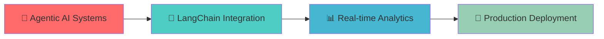

# 🌊 Afolabi Olawale

### *Where Mathematics Meets Machine Intelligence*

## 🎯 The Story Behind the Code

**"Every dataset tells a story. I help organizations listen."**

From predicting e-sign behavior in digital lending to building AI-powered confidence coaches, I specialize in turning complex data challenges into elegant, production-ready solutions. With a mathematician's precision and an engineer's pragmatism, I build AI systems that don't just work in notebooks—they thrive in the real world.

---

## 🛠️ My Arsenal

### Core Technologies

### AI/ML Expertise

### Visualization & Analytics  

---

## 🚀 Featured Projects That Solve Real Problems

<table>
<tr>
<td width="50%">

### 🧠 [ConfidenceAI - Personal Coach](https://github.com/walethewave/AI-Powered-Confidence-Coaching-App)
**🌟 LIVE DEMO AVAILABLE**
> *AI-powered confidence coaching that actually works*

- **The Challenge**: Traditional self-help is generic and ineffective
- **My Solution**: Personalized AI coach using Gemini API + psychology frameworks
- **Impact**: Interactive Streamlit app with real user engagement
- **Tech**: `Streamlit` `Google Gemini` `Pydantic` `Psychology APIs`

[🚀 Try It Live](https://9punzdhswetzx92taubijy.streamlit.app/) | [📖 Documentation](https://github.com/walethewave/AI-Powered-Confidence-Coaching-App)

</td>
<td width="50%">

### 🏦 [Digital Lending E-Sign Predictor](https://github.com/walethewave/Digital-Lending-E-Sign-Prediction-System)
**💼 PRODUCTION ML SYSTEM**
> *Predicting loan applicant behavior in digital finance*

- **Business Impact**: Streamline digital lending operations
- **Innovation**: ML-powered e-sign prediction for targeted engagement
- **Real-World Value**: Reduce friction, optimize onboarding
- **Tech**: `Scikit-learn` `Feature Engineering` `Classification` `Banking ML`

[🔍 Explore Code](https://github.com/walethewave/Digital-Lending-E-Sign-Prediction-System)

</td>
</tr>
<tr>
<td width="50%">

### 📊 [Sentiment Lab - Production NLP](https://github.com/walethewave/Sentiment-Lab-NLP)
**⚡ END-TO-END PIPELINE**
> *From raw text to actionable emotional insights*

- **Innovation**: Modular, production-grade sentiment analysis
- **Features**: Multiple algorithms, performance benchmarks, API-ready
- **Learning**: Comparative analysis of TF-IDF vs modern approaches
- **Tech**: `NLTK` `TF-IDF` `Naive Bayes` `Performance Optimization`

[📖 View Project](https://github.com/walethewave/Sentiment-Lab-NLP)

</td>
<td width="50%">

### 🤖 [AI Sentence Completion](https://github.com/walethewave/-AI-Powered-Sentence-Completion)
**🎯 CREATIVE NLP APPLICATION**
> *Intelligent text prediction and completion*

- **Challenge**: Generate coherent and contextually relevant text
- **Technical Achievement**: Custom training for natural completions
- **Application**: Writing assistance and language modeling
- **Tech**: `NLP` `Text Generation` `Language Models` `TF-IDF`

[🚀 Explore Code](https://github.com/walethewave/-AI-Powered-Sentence-Completion)

</td>
</tr>
</table>

### 📈 Additional Projects

| Project | Description | Key Achievement | Tech Stack |
|---------|-------------|-----------------|------------|
| [💰 Smart Salary Predictor](https://github.com/walethewave/smart-salary-predictor) | ML model predicting compensation from experience | High-accuracy salary forecasting | `Regression` `Scikit-learn` `Feature Engineering` |
| [🤚 Sign Language Recognition](https://github.com/walethewave/Sign-Language-Hand-Gesture-Recognition-Using--CNN) | CNN-based hand gesture recognition system | Real-time sign language translation | `CNN` `TensorFlow` `Computer Vision` `Deep Learning` |
| [📊 Retail Intelligence](https://github.com/walethewave/retail-intelligence) | Complete sales analytics dashboard | Identified 23% revenue opportunity | `SQL` `Power BI` `Excel` |

---

## 🎯 What I'm Building Next

```mermaid
graph LR
    A[🤖 Agentic AI Systems] --> B[🔗 LangChain Integration]
    B --> C[📊 Real-time Analytics]
    C --> D[🚀 Production Deployment]
    
    style A fill:#ff6b6b
    style B fill:#4ecdc4
    style C fill:#45b7d1
    style D fill:#96ceb4
```

**Current Focus Areas:**
- 🧠 **Agentic AI**: Building autonomous systems with Gemini & OpenAI APIs
- 🔗 **LangChain Mastery**: Creating sophisticated AI workflows  
- 📊 **Explainable AI**: Making black-box models transparent
- 🎯 **Low-Resource ML**: Efficient models for real-world constraints

---

## 📊 GitHub Analytics

---

## 🌟 Why Work With Me?

| 🎯 **Problem Solver** | 🚀 **Production Ready** | 📚 **Continuous Learner** |
|:---------------------:|:------------------------:|:--------------------------:|
| I tackle messy, real-world data challenges | My code runs in production, not just notebooks | Always exploring cutting-edge AI techniques |
| *Digital lending predictions & NLP systems* | *Live Streamlit apps with real users* | *Currently mastering LangChain & Agents* |

---

## 🤝 Let's Build Something Amazing Together

**🔍 Actively seeking:** AI Engineer roles, Data Science internships, and exciting freelance projects

**💡 Passionate about:** Turning complex problems into elegant solutions that create real value

**🎯 Ready for:** Your next data challenge, whether it's building AI agents, analyzing complex datasets, or creating production ML systems

*"The best way to predict the future is to build it with data."* 🚀

