# 🌊 Olawale "WaveTheData" Adebayo
### *Where Mathematics Meets Machine Intelligence*

## 🎯 The Story Behind the Code

**"Every dataset tells a story. I help organizations listen."**

From detecting fraudulent transactions in messy financial logs to building AI-powered confidence coaches, I specialize in turning complex data challenges into elegant, production-ready solutions. With a mathematician's precision and an engineer's pragmatism, I build AI systems that don't just work in notebooks—they thrive in the real world.

---

## 🛠️ My Arsenal

### Core Technologies

### AI/ML Expertise

### Visualization & Analytics  

---

## 🚀 Featured Projects That Solve Real Problems

<table>
<tr>
<td width="50%">

### 🧠 [ConfidenceAI - Personal Coach](https://github.com/walethewave/confidenceai)
**🌟 LIVE DEMO AVAILABLE**
> *AI-powered confidence coaching that actually works*

- **The Challenge**: Traditional self-help is generic and ineffective
- **My Solution**: Personalized AI coach using Gemini API + psychology frameworks
- **Impact**: Interactive Streamlit app with real user engagement
- **Tech**: `Streamlit` `Google Gemini` `Pydantic` `Psychology APIs`

[🚀 Try It Live](https://confidenceai-demo.streamlit.app) | [📖 Documentation](https://github.com/walethewave/confidenceai)

</td>
<td width="50%">

### 🕵️ [Anomaly Detection in Financial Logs](https://github.com/walethewave/financial-anomaly-detection)
**🏆 PORTFOLIO HIGHLIGHT**
> *Finding fraud in messy, unstructured financial data*

- **The Challenge**: Real financial logs aren't clean CSVs
- **My Innovation**: Regex + NLP pipeline for raw log parsing
- **Achievement**: Detects patterns humans miss in unstructured text
- **Tech**: `NLP` `Regex` `Scikit-learn` `Pattern Recognition`

[🔍 Explore Code](https://github.com/walethewave/financial-anomaly-detection)

</td>
</tr>
<tr>
<td width="50%">

### 📊 [Sentiment Lab - Production NLP](https://github.com/walethewave/sentiment-lab)
**⚡ END-TO-END PIPELINE**
> *From raw text to actionable emotional insights*

- **Innovation**: Modular, production-grade sentiment analysis
- **Features**: Multiple algorithms, performance benchmarks, API-ready
- **Learning**: Comparative analysis of TF-IDF vs modern approaches
- **Tech**: `NLTK` `TF-IDF` `Naive Bayes` `Performance Optimization`

</td>
<td width="50%">

### 🎮 [Game Narrative Generator](https://github.com/walethewave/game-narrative-generator)
**🎯 CREATIVE AI APPLICATION**
> *AI that writes compelling game storylines*

- **Creative Challenge**: Generate coherent fantasy narratives
- **Technical Achievement**: Custom training on game-specific corpus
- **User Experience**: Interactive web interface for story generation
- **Tech**: `TF-IDF` `Text Generation` `Streamlit` `Creative AI`

[🎮 Generate Stories Live](https://game-narrative-demo.streamlit.app)

</td>
</tr>
</table>

### 📈 Additional Projects

| Project | Description | Key Achievement | Tech Stack |
|---------|-------------|-----------------|------------|
| [💰 Salary Predictor](https://github.com/walethewave/salary-prediction) | ML model predicting compensation from experience | 94% accuracy on real market data | `Regression` `Scikit-learn` |
| [🏪 Retail Intelligence](https://github.com/walethewave/retail-intelligence) | Complete sales analytics dashboard | Identified 23% revenue opportunity | `SQL` `Power BI` `Excel` |
| [📊 Predictive ETL Pipeline](https://github.com/walethewave/predictive-etl) | End-to-end data pipeline with forecasting | Automated data processing + ML | `ETL` `Pandas` `Forecasting` |

---

## 🎯 What I'm Building Next

```mermaid
graph LR
    A[🤖 Agentic AI Systems] --> B[🔗 LangChain Integration]
    B --> C[📊 Real-time Analytics]
    C --> D[🚀 Production Deployment]
    
    style A fill:#ff6b6b
    style B fill:#4ecdc4
    style C fill:#45b7d1
    style D fill:#96ceb4
```

**Current Focus Areas:**
- 🧠 **Agentic AI**: Building autonomous systems with Gemini & OpenAI APIs
- 🔗 **LangChain Mastery**: Creating sophisticated AI workflows  
- 📊 **Explainable AI**: Making black-box models transparent
- 🎯 **Low-Resource ML**: Efficient models for real-world constraints

---

## 📊 GitHub Analytics

---

## 🌟 Why Work With Me?

| 🎯 **Problem Solver** | 🚀 **Production Ready** | 📚 **Continuous Learner** |
|:---------------------:|:------------------------:|:--------------------------:|
| I tackle messy, real-world data challenges | My code runs in production, not just notebooks | Always exploring cutting-edge AI techniques |
| *Financial fraud detection from raw logs* | *Live Streamlit apps with real users* | *Currently mastering LangChain & Agents* |

---

## 🤝 Let's Build Something Amazing Together

**🔍 Actively seeking:** AI Engineer roles, Data Science internships, and exciting freelance projects

**💡 Passionate about:** Turning complex problems into elegant solutions that create real value

**🎯 Ready for:** Your next data challenge, whether it's building AI agents, analyzing complex datasets, or creating production ML systems

*"The best way to predict the future is to build it with data."* 🚀

